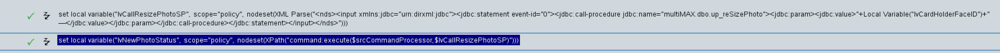
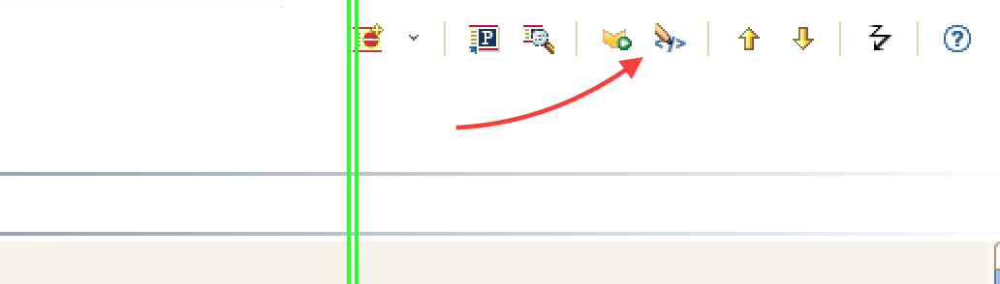
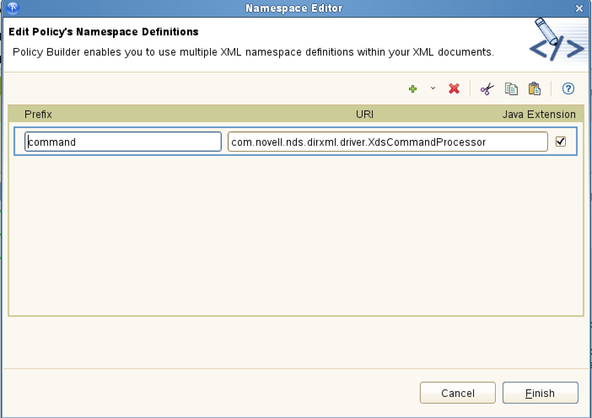

# Call a stored procedure via policy in a JDBC driver

It’s two actions:

1) Setup the scored procedure statement and load it into a var
```
<do-set-local-variable name="lvCallResizePhotoSP" scope="policy">
<arg-node-set>
<token-xml-parse>
<token-text xml:space="preserve">&lt;nds>&lt;input xmlns:jdbc="urn:dirxml:jdbc">&lt;jdbc:statement event-id="0">&lt;jdbc:call-procedure jdbc:name="multiMAX.dbo.up_reSizePhoto">&lt;jdbc:param>&lt;jdbc:value></token-text>
<token-local-variable name="lvCardHolderFaceID"/>
<token-text xml:space="preserve">&lt;/jdbc:value>&lt;/jdbc:param>&lt;/jdbc:call-procedure>&lt;/jdbc:statement>&lt;/input>&lt;/nds></token-text>
</token-xml-parse>
</arg-node-set>
</do-set-local-variable>
```
2) Actually execute the stored procedure and get the status back into a var
```
<do-set-local-variable name="lvNewPhotoStatus" scope="policy">
<arg-node-set>
<token-xpath expression="command:execute($srcCommandProcessor,$lvCallResizePhotoSP)"/>
</arg-node-set>
</do-set-local-variable>
```
It should look like this when you are done:


You'll also have to setup the namespace:
with `command` and `com.novell.nds.dirxml.driver.XdsCommandProcessor`



